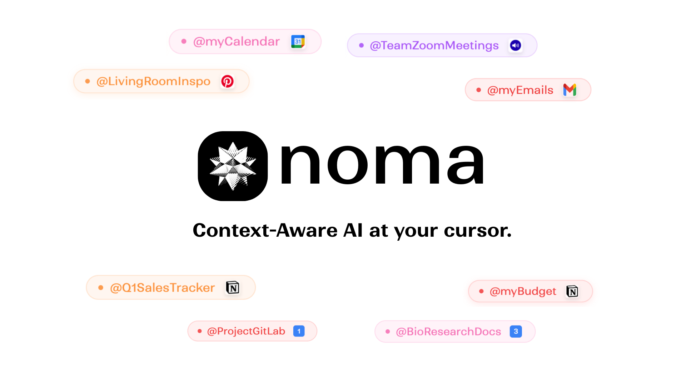

**Noma** is a chrome extension that brings context-aware AI to your cursor. Through **curated tags**, it brings your **personal context** – ideas you save while browsing, Notion pages, Pinterest boards, docs, even audio notes – straight into the conversation, wherever you’re working. No switching, no searching, no starting from scratch. Just **inline AI** that finally understands what you mean.

By default, Noma runs **on-device** with **Gemini Nano** and uses the **Multimodal Prompt API** to support text and image inputs for providing text responses. This runs entirely **Client Side**, meaning privacy first for your data. Noma also offers **Hybrid Server Side AI** features: To generate image outputs using your context, Noma uses **Gemini 2.5 Flash Image** via the **Gemini Developer API**. For contexts that are too large for Nano (≈ **25,000+ characters**), Noma uses **RAG** backed by an **OpenAI embedding model** to retrieve only the most relevant pieces to create a reduced context for the final prompt. 

---

## Installation

Noma is an **unpublished Chrome extension**, so testing requires a local installation. Go to [TESTING_NOMA.md](TESTING_NOMA.md) to follow the setup instructions.

---

## Basic Usage

**Creating Tags**

To create a tag, or save context to an existing tag, right-click on any selected text / image / audio file and click Save to Tag. To save PDFs, go to Noma icon → Settings → Connect Document.


## How to Use Noma While You Work:

| Shortcut | Action |
|----------|--------|
| `Ctrl + Q` | Open tag selector |
| `Ctrl + Space` | Generate response (text or image) |

Press `Ctrl + Q` to open Tag Selector anywhere, pick a `@tag`, type your prompt, then press `Ctrl + Space` to hit Enter. Keyboard commands are the same for Mac/Windows. You can also just type `@yourTagName` instead of selecting it via the Tag Selector.

### Tag Format
All Noma prompts follow this structure:
```
@tagName Your Prompt
```

### Text Generation (Client Side) Examples 
Text Inputs:
```
@myResearchNotes Give my friend a summary of the papers I read today 
```
Image Inputs:
```
@RoomDecorIdeas Write a blog post about my best room decor pics from my Pinterest board
```
Press `Ctrl + Space` to generate a text response using Gemini Nano via the Multimodal Prompt API.

### Image Generation (Server Side Text-to-Image) Examples
To generate images, use the **`Create`** keyword right after a @tag:
```
@DesignNotes Create a modern logo for my coffee shop based on all my ideas
```
Press `Ctrl + Space` to generate an image using Gemini 2.5 Flash Image via the Gemini Developer API.


---

## Tips

### Tags not showing / Tag selector not opening on Ctrl + Q
- Reload the extension &/ refresh the page you are trying to use Noma on!
- Noma currently works across many platforms including Gmail, Slack, Google Colab, LinkedIn, Most Search bars, AI chats like ChatGPT, Claude & Perplexity, Github etc.
- The tag selector may not be trigger properly on platforms like Google Docs, Medium, Notion, etc. We hope to update this soon.

### How can I use Temporary Context without saving it to a tag?
- Highlight text on any webpage
- Click the Noma spinner icon that appears ("Shared with Noma!")
- This saves temporary context for your next prompt 
- Use it immediately with any tag
- When you hit Ctrl + Space, the temporary context will be deleted.

---

## Integration Setup

To learn how to setup integrations with **Notion**, **Gmail**, **Pinterest**, and **Google Calendar**, see the [TESTING_NOMA.md](TESTING_NOMA.md) guide
